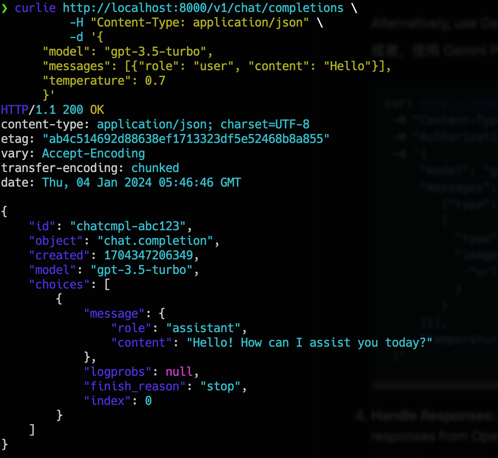
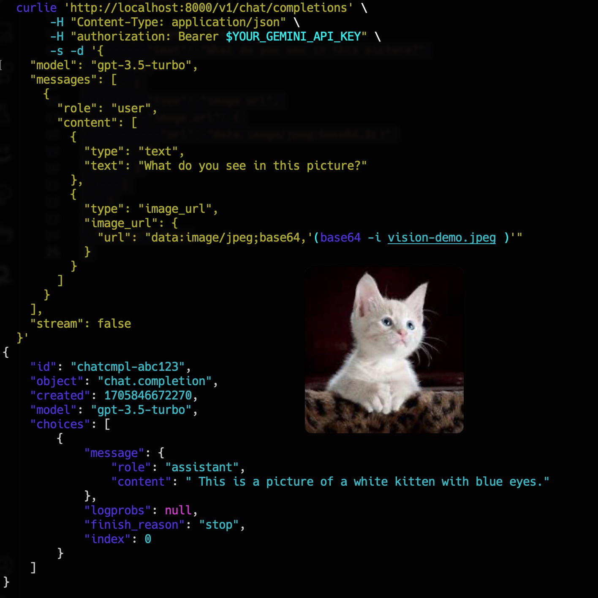

# Gemini-OpenAI-Proxy

Gemini-OpenAI-Proxy is a proxy software. It is designed to convert OpenAI API
protocol calls into Google Gemini Pro protocol, so that software using OpenAI
protocol can use Gemini Pro model without perception.

If you're interested in using Google Gemini but don't want to modify your
software, Gemini-OpenAI-Proxy is a great option. It allows you to easily
integrate the powerful features of Google Gemini without having to do any
complex development work.

## Demo

> Get api key from <https://makersuite.google.com/app/apikey>

<details open>

<summary>✅ Gemini Pro</summary>

```shell
curl -s http://localhost:8000/v1/chat/completions \
  -H "Authorization: Bearer $YOUR_GEMINI_API_KEY" \
  -H "Content-Type: application/json" \
  -d '{
      "model": "gpt-3.5-turbo",
      "messages": [{"role": "user", "content": "Hello, Who are you?"}],
      "temperature": 0.7
      }'
```



</details>

<details>

<summary>✅ Gemini Pro Vision</summary>

```shell
curl -s http://localhost:8000/v1/chat/completions \
  -H "Authorization: Bearer $YOUR_GEMINI_API_KEY" \
  -H "Content-Type: application/json" \
  -d '{
  "model": "gpt-4-vision-preview",
  "messages": [
    {
      "role": "user",
      "content": [
        {
          "type": "text",
          "text": "What do you see in this picture?"
        },
        {
          "type": "image_url",
          "image_url": {
            "url": "data:image/png;base64,iVBORw0KGgoAAAANSUhEUgAAADAAAAAnAgMAAAA0vyM3AAAACVBMVEX/4WwCAgF3aTMcpbzGAAAAa0lEQVR4nGOgAWB1QOYEIHFEcXKmhCBxQqYgcSLEEGymAFEEhzFAFYmTwNoA53A6IDmB1YETidPAiLBVFGgEgrNqJYIzNTQU4Z5QZA6QNQ3hGpAZcNegceBOADFQOQlQDhfQyUwLkPxKVwAABbkRCcDA66QAAAAASUVORK5CYII="
          }
        }
      ]
    }
  ],
  "stream": false
}'
```



</details>

## Plan

- [x] `/v1/chat/completions`
  - [x] stream
  - [x] complete

## Model Mappings

| OpenAI Model         | Gemini Model                 |
| -------------------- | ---------------------------- |
| gpt-3.5-turbo        | gemini-1.0-pro-latest        |
| gpt-4                | gemini-1.5-pro-latest        |
| gpt-4-vision-preview | gemini-1.0-pro-vision-latest |
| gpt-4-turbo          | gemini-1.5-pro-latest        |
| gpt-4o               | gemini-1.5-flash-latest      |
| gpt-4-turbo-preview  | gemini-1.5-pro-latest        |
| ...others            | gemini-1.0-pro-latest        |

## Run On Serverless

### [Cloudflare Workers](https://workers.cloudflare.com)

> build command `npm run build:cf_worker`

Copy [`main_cloudflare-workers.mjs`](./dist/main_cloudflare-workers.mjs) to
`cloudflare-workers`

### [Deno Deploy](https://deno.com/deploy)

> build command `npm run build:deno`

Copy [`main_deno.mjs`](./dist/main_deno.mjs) to `deno deploy`

### [Vercel](https://vercel.com)

> build command `npm run build:cf_worker`

[](https://vercel.com/new/clone?repository-url=https://github.com/zuisong/gemini-openai-proxy&repository-name=gemini-openai-proxy)

- Alternatively can be deployed with [cli](https://vercel.com/docs/cli):
  `vercel deploy`
- Serve locally: `vercel dev`
- Vercel _Functions_
  [limitations](https://vercel.com/docs/functions/limitations) (with _Edge_
  runtime)

## Run On Local

### deno

```shell
deno task start:deno
```

### node

```shell
npm install && npm run start:node
```

### bun

```shell
bun run start:bun
```

### docker

```shell
docker run -d -p 8000:8000 ghcr.io/zuisong/gemini-openai-proxy:deno
## or
docker run -d -p 8000:8000 ghcr.io/zuisong/gemini-openai-proxy:bun
## or
docker run -d -p 8000:8000 ghcr.io/zuisong/gemini-openai-proxy:node
```

## Star History

<a href="https://star-history.com/#zuisong/gemini-openai-proxy&Date">
  <picture>
    <source media="(prefers-color-scheme: dark)" srcset="https://api.star-history.com/svg?repos=zuisong/gemini-openai-proxy&type=Date&theme=dark" />
    <source media="(prefers-color-scheme: light)" srcset="https://api.star-history.com/svg?repos=zuisong/gemini-openai-proxy&type=Date" />
    
  </picture>
</a>
